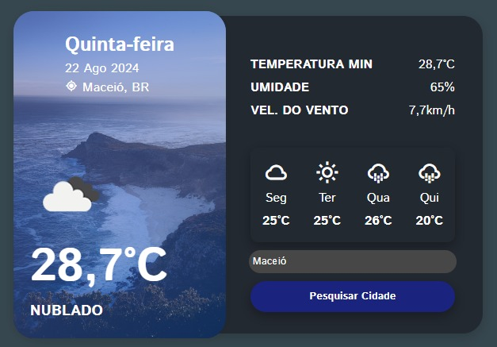

# Weather App 🔆

Este projeto foi desenvolvido com o objetivo de aprimorar minhas habilidades em UI design e lógica de programação, utilizando uma API de previsão do tempo. As tecnologias empregadas foram HTML, CSS e JavaScript. A interface foi desenhada para ser visualmente atraente e funcional, sem foco em responsividade. Atualmente, o projeto está 90% concluído; a funcionalidade de previsão do tempo futura ainda está em desenvolvimento. Este projeto destaca a importância do design e da usabilidade na criação de interfaces web.

## Autores

- [@ErickFerreira](https://www.github.com/ErickFerrei)

## Demonstração

</img>
